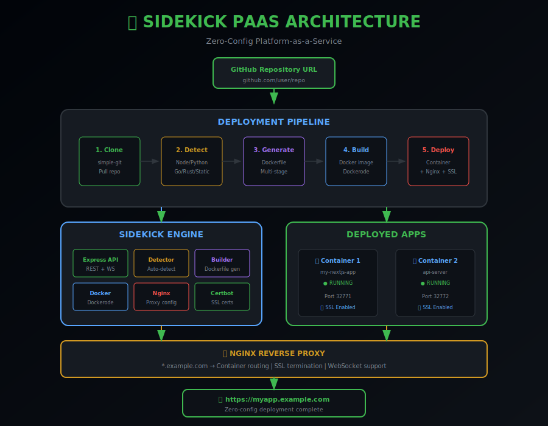

# 🚀 Sidekick PaaS

**Zero-Config Platform-as-a-Service** — Deploy any GitHub repo with one command.



---

## 🎯 What

Sidekick is a self-hosted deployment platform that takes any GitHub repository and:

1. **Clones** the repository
2. **Detects** the project type (Node.js, Python, Go, Rust, static)
3. **Generates** an optimized Dockerfile
4. **Builds** and runs a container
5. **Configures** Nginx reverse proxy
6. **Issues** SSL certificates (Let's Encrypt)

Think of it as a **self-hosted Vercel/Heroku alternative**.

### Key Features

- 🔍 **Auto-Detection** — Supports Next.js, React, Vue, Express, FastAPI, Flask, Go, Rust
- 📝 **Smart Dockerfiles** — Generates optimized multi-stage builds
- 🔒 **Automatic SSL** — Let's Encrypt integration with auto-renewal
- 📊 **Real-time Logs** — Stream build and container logs via WebSocket
- 🎛️ **Dashboard** — Monitor, restart, and manage deployments
- 🐳 **Fully Containerized** — Everything runs in Docker

---

## 🛠️ How

### Quick Start

```bash
# Clone the repository
git clone https://github.com/tommieseals/sidekick-paas.git
cd sidekick-paas

# Start with Docker Compose
docker-compose up -d

# Open http://localhost:3002
```

### Deploy a Project

1. Click "New Project"
2. Paste a GitHub URL (e.g., `https://github.com/vercel/next.js`)
3. Choose a subdomain (e.g., `myapp`)
4. Click Deploy
5. Watch the build logs stream in real-time
6. Access your app at `https://myapp.yourdomain.com`

### Development Setup

```bash
# Backend
cd backend
npm install
npm run dev

# Frontend (new terminal)
cd frontend
npm install
npm run dev
```

---

## 💡 Why

### The Problem

Deploying applications typically requires:
- Writing Dockerfiles
- Configuring nginx/reverse proxies
- Setting up SSL certificates
- Managing container orchestration
- Monitoring and log aggregation

### The Solution

**One URL → Fully deployed app with HTTPS.**

Sidekick handles all the infrastructure complexity:

```
Input:  https://github.com/user/nextjs-app
Output: https://nextjs-app.example.com (with SSL)
```

### Why This Matters for Employers

| Skill | Implementation |
|-------|----------------|
| **DevOps/Infrastructure** | Docker, Nginx, SSL/TLS automation |
| **System Design** | Pipeline architecture, service orchestration |
| **Full-Stack** | React dashboard + Express API |
| **Real-time Systems** | WebSocket log streaming |
| **API Design** | RESTful endpoints, deployment workflows |

---

## 🔧 Supported Project Types

| Type | Detection | Default Port |
|------|-----------|--------------|
| **Next.js** | `next` in package.json | 3000 |
| **React** | `react` + `vite`/`react-scripts` | 80 |
| **Vue.js** | `vue` in package.json | 80 |
| **Express** | `express` in package.json | 3000 |
| **FastAPI** | `fastapi` in requirements.txt | 8000 |
| **Flask** | `flask` in requirements.txt | 5000 |
| **Django** | `django` in requirements.txt | 8000 |
| **Go** | `go.mod` present | 8080 |
| **Rust** | `Cargo.toml` present | 8080 |
| **Static** | `index.html` at root | 80 |
| **Custom** | Existing `Dockerfile` | — |

---

## 🏗️ Architecture

```
┌──────────────┐     ┌──────────────────┐     ┌──────────────────┐
│  GitHub URL  │────▶│  Sidekick Engine │────▶│  Docker + Nginx  │
│              │     │                  │     │                  │
│  user/repo   │     │  Detect → Build  │     │  Containers +    │
│              │     │  → Deploy        │     │  Reverse Proxy   │
└──────────────┘     └──────────────────┘     └──────────────────┘
                             │
                      ┌──────┴──────┐
                      │   Certbot   │
                      │   SSL/TLS   │
                      └─────────────┘
```

### Pipeline Steps

1. **Clone** — Pull repository with simple-git
2. **Detect** — Analyze package.json, requirements.txt, etc.
3. **Generate** — Create optimized Dockerfile
4. **Build** — Build Docker image with Dockerode
5. **Run** — Start container with port mapping
6. **Proxy** — Generate nginx config
7. **SSL** — Request Let's Encrypt certificate

---

## 📁 Project Structure

```
sidekick-paas/
├── backend/
│   ├── src/
│   │   ├── index.js              # Express + WebSocket server
│   │   ├── routes/
│   │   │   ├── projects.js       # CRUD + container control
│   │   │   ├── deploy.js         # Deployment pipeline
│   │   │   └── logs.js           # Log streaming
│   │   ├── services/
│   │   │   ├── git.js            # Repository cloning
│   │   │   ├── detector.js       # Project type detection
│   │   │   ├── dockerBuilder.js  # Dockerfile generation
│   │   │   ├── docker.js         # Container management
│   │   │   └── nginx.js          # Proxy configuration
│   │   └── db/
│   │       └── sqlite.js
│   └── package.json
│
├── frontend/
│   ├── src/
│   │   ├── App.jsx
│   │   ├── components/
│   │   │   ├── ProjectList.jsx
│   │   │   ├── ProjectCard.jsx
│   │   │   ├── DeployForm.jsx
│   │   │   └── BuildModal.jsx
│   │   └── index.css
│   └── package.json
│
├── docker-compose.yml
├── Dockerfile
├── DESIGN.md
└── README.md
```

---

## 🔌 API Endpoints

### Projects
| Method | Endpoint | Description |
|--------|----------|-------------|
| GET | `/api/projects` | List all projects |
| POST | `/api/projects` | Create project |
| DELETE | `/api/projects/:id` | Delete project |
| POST | `/api/projects/:id/start` | Start container |
| POST | `/api/projects/:id/stop` | Stop container |
| POST | `/api/projects/:id/restart` | Restart container |

### Deployment
| Method | Endpoint | Description |
|--------|----------|-------------|
| POST | `/api/deploy` | Deploy from GitHub URL |
| POST | `/api/deploy/:id/redeploy` | Redeploy project |
| GET | `/api/deploy/:id/status` | Get deployment status |

### Logs
| Method | Endpoint | Description |
|--------|----------|-------------|
| GET | `/api/logs/:id` | Get container logs |
| WS | `build:log` | Stream build logs |

---

## 📄 License

MIT License — Use freely for learning and building.

---

## 👨‍💻 Author

**Tommie Seals**

- GitHub: [@tommieseals](https://github.com/tommieseals)

---

*Built with 🚀 and Docker-in-Docker magic*
