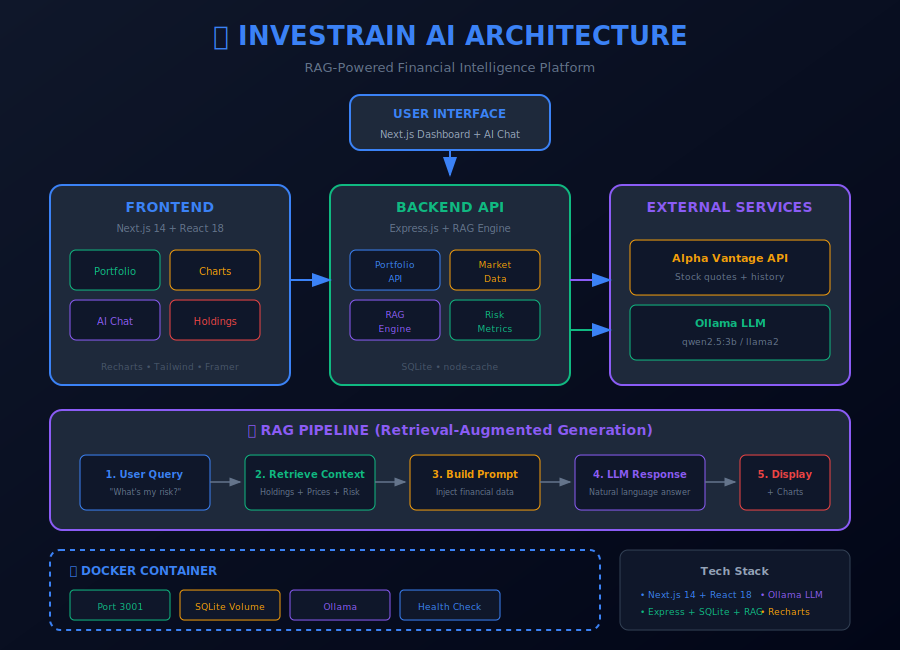

# 💹 Investrain AI

**AI-Powered Investment Tracker** — Chat with your portfolio using natural language.



---

## 🎯 What

Investrain AI is a smart investment dashboard that combines financial data visualization with **conversational AI**. Instead of digging through charts and tables, simply ask:

```
"What is my highest-risk asset?"
"Summarize my performance this month"
"Am I too exposed to tech?"
```

The AI analyzes your portfolio data and responds with **data-driven insights**.

### Key Features

- 📊 **Real-time Dashboard** — Portfolio value, holdings, sector allocation
- 🤖 **RAG-Powered AI** — Chat with your portfolio data
- 📈 **Interactive Charts** — Performance trends and sector breakdown
- 🔒 **Risk Analytics** — Beta, volatility, concentration metrics
- 🐳 **Containerized** — One-command Docker deployment
- 🏠 **Local LLM** — Uses Ollama (no cloud API needed)

---

## 🛠️ How

### Quick Start (Docker)

```bash
# Clone repository
git clone https://github.com/tommieseals/investrain-ai.git
cd investrain-ai

# Start with Docker Compose
docker-compose up -d

# Open http://localhost:3001
```

### Development Setup

```bash
# Backend
cd backend
npm install
npm run dev

# Frontend (new terminal)
cd frontend
npm install
npm run dev

# Open http://localhost:3000
```

### Environment Variables

| Variable | Default | Description |
|----------|---------|-------------|
| `PORT` | `3001` | Backend server port |
| `OLLAMA_URL` | `http://localhost:11434` | Ollama API endpoint |
| `OLLAMA_MODEL` | `qwen2.5:3b` | LLM model for chat |
| `ALPHA_VANTAGE_KEY` | `demo` | Market data API key |
| `USE_MOCK_DATA` | `true` | Use demo data |

---

## 💡 Why

### The Problem

Traditional portfolio trackers show you data but don't help you understand it:
- What does a beta of 1.3 mean for my risk?
- Is 65% tech exposure too much?
- Which holdings are dragging down performance?

### The Solution

**Ask questions in plain English.** The AI:
1. Retrieves your portfolio data (holdings, prices, risk metrics)
2. Injects it into a financial context prompt
3. Generates natural language insights with specific numbers

This is **RAG (Retrieval-Augmented Generation)** applied to personal finance.

### Why This Matters for Employers

| Skill | Implementation |
|-------|----------------|
| **RAG/LLM Integration** | Custom prompt engineering with financial context |
| **Full-Stack Development** | Next.js frontend + Express backend |
| **Data Visualization** | Recharts with custom tooltips and theming |
| **Financial Domain** | Risk metrics, volatility, sector analysis |
| **API Design** | RESTful endpoints with caching |
| **DevOps** | Docker multi-stage builds, health checks |

---

## 🧠 RAG Pipeline

```
┌──────────────┐    ┌──────────────┐    ┌──────────────┐    ┌──────────────┐
│ User Query   │───▶│ Retrieve     │───▶│ Build Prompt │───▶│ LLM Response │
│              │    │ Portfolio    │    │ with Context │    │              │
│ "Risk?"      │    │ Data         │    │              │    │ "TSLA has    │
│              │    │              │    │              │    │ highest σ"   │
└──────────────┘    └──────────────┘    └──────────────┘    └──────────────┘
```

### Context Injection

The AI receives your complete portfolio state:

```
PORTFOLIO SUMMARY:
- Total Value: $125,432
- Daily Change: +$1,234 (+0.99%)
- Portfolio Beta: 1.24

HOLDINGS:
| Symbol | Value   | Today  | Volatility |
| AAPL   | $8,750  | +1.2%  | 25%        |
| TSLA   | $6,250  | -2.4%  | 45%        |
...

USER QUESTION: What is my highest-risk asset?
```

---

## 📋 Example AI Conversations

### Risk Analysis
```
Q: "What is my highest-risk asset?"

A: Based on volatility metrics, **TSLA** has the highest risk with:
   - Volatility: 45.2%
   - Beta: 1.8 (80% more volatile than S&P 500)
   - Portfolio weight: 5% ($6,250)
   
   Consider: Your portfolio beta of 1.24 suggests above-average market risk.
```

### Performance Summary
```
Q: "How am I doing this month?"

A: Your portfolio is up **4.2%** ($5,108) this month:
   - Best performer: NVDA (+12.3%)
   - Worst performer: GOOGL (-3.1%)
   - vs S&P 500: +2.8% (beating by 1.4%)
```

### Allocation Advice
```
Q: "Am I too concentrated in tech?"

A: Yes, 65% of your portfolio is in Technology.
   - S&P 500 tech weight: ~28%
   - Your exposure: 2.3x the market
   
   Consider diversifying into Healthcare or Utilities for balance.
```

---

## 🏗️ Architecture

```
┌─────────────────┐     ┌──────────────────┐     ┌──────────────────┐
│   Next.js UI    │────▶│   Express API    │────▶│   Data Layer     │
│   Dashboard     │     │   RAG Engine     │     │   SQLite + Cache │
│   AI Chat       │◀────│   Risk Metrics   │◀────│                  │
└─────────────────┘     └──────────────────┘     └──────────────────┘
                               │
                        ┌──────┴──────┐
                        │   Ollama    │
                        │   LLM       │
                        └─────────────┘
```

---

## 📁 Project Structure

```
investrain-ai/
├── backend/
│   ├── src/
│   │   ├── index.js              # Express server
│   │   ├── routes/               # API endpoints
│   │   ├── services/
│   │   │   ├── marketData.js     # Stock quotes
│   │   │   ├── ragEngine.js      # RAG orchestration
│   │   │   └── llm.js            # Ollama interface
│   │   └── db/
│   │       └── sqlite.js         # Database
│   └── package.json
│
├── frontend/
│   ├── app/
│   │   ├── layout.tsx
│   │   ├── page.tsx              # Dashboard
│   │   └── globals.css
│   ├── components/
│   │   ├── PortfolioSummary.tsx
│   │   ├── HoldingsTable.tsx
│   │   ├── PerformanceChart.tsx
│   │   ├── SectorPieChart.tsx
│   │   └── AIChat.tsx
│   └── package.json
│
├── docker-compose.yml
├── Dockerfile
├── DESIGN.md
└── README.md
```

---

## 🔌 API Endpoints

### Portfolio
| Method | Endpoint | Description |
|--------|----------|-------------|
| GET | `/api/portfolio` | Full portfolio with metrics |
| POST | `/api/portfolio/holdings` | Add holding |
| DELETE | `/api/portfolio/holdings/:id` | Remove holding |

### AI Chat
| Method | Endpoint | Description |
|--------|----------|-------------|
| POST | `/api/chat` | Ask question about portfolio |
| GET | `/api/chat/history` | Get conversation history |
| GET | `/api/chat/suggestions` | Get suggested questions |

### Market Data
| Method | Endpoint | Description |
|--------|----------|-------------|
| GET | `/api/market/quote/:symbol` | Get stock quote |
| GET | `/api/market/history/:symbol` | Get price history |

---

## 📄 License

MIT License — Use freely for learning and building.

---

## 👨‍💻 Author

**Tommie Seals**

- GitHub: [@tommieseals](https://github.com/tommieseals)
- Portfolio: [ai-portfolio](https://github.com/tommieseals/ai-portfolio)

---

*Built with 💹 and RAG-powered intelligence*
