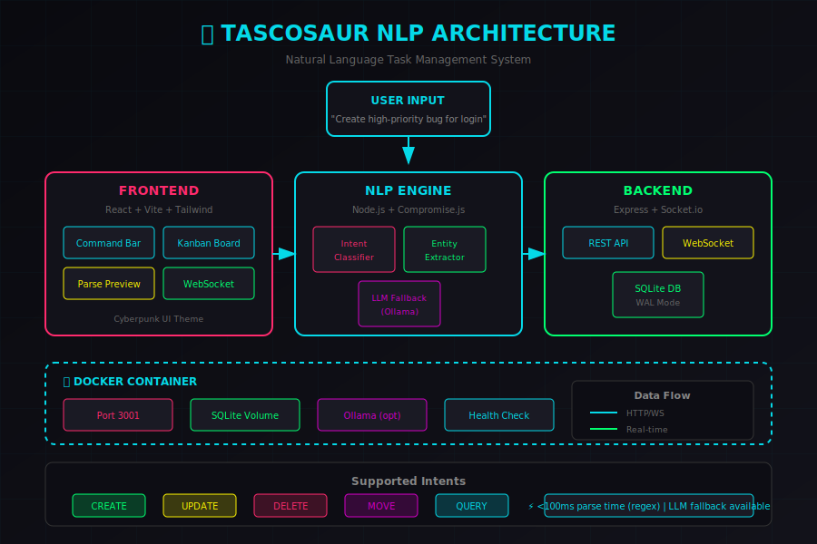

# 🦖 Tascosaur NLP

**Natural Language Task Management** — Create, update, and manage tasks using plain English commands.



---

## 🎯 What

Tascosaur is an **intent-based task management system** where tasks are created through natural language, not forms. Instead of clicking through UI elements, simply type:

```
"Create a high-priority bug ticket for the login page"
```

And watch it transform into a structured task:

```json
{
  "intent": "CREATE",
  "task": {
    "title": "Login page bug",
    "priority": "high",
    "tags": ["bug"],
    "status": "backlog"
  }
}
```

### Key Features

- 🧠 **NLP-Powered** — Understands natural language commands
- ⚡ **Real-time** — WebSocket sync across all clients
- 🎨 **Cyberpunk UI** — Beautiful neon-themed Kanban board
- 🤖 **LLM Fallback** — Ollama integration for complex inputs
- 🐳 **Containerized** — Production-ready Docker setup
- 📱 **Responsive** — Works on desktop and mobile

---

## 🛠️ How

### Quick Start (Docker)

```bash
# Clone the repository
git clone https://github.com/tommieseals/tascosaur-nlp.git
cd tascosaur-nlp

# Start with Docker Compose
docker-compose up -d

# Open http://localhost:3001
```

### Development Setup

```bash
# Backend
cd backend
npm install
npm run dev

# Frontend (new terminal)
cd frontend
npm install
npm run dev

# Open http://localhost:5173
```

### Environment Variables

| Variable | Default | Description |
|----------|---------|-------------|
| `PORT` | `3001` | Backend server port |
| `OLLAMA_URL` | `http://localhost:11434` | Ollama API endpoint |
| `OLLAMA_MODEL` | `qwen2.5:3b` | Model for LLM fallback |
| `DB_PATH` | `./data/tasks.db` | SQLite database path |

---

## 💡 Why

### The Problem

Traditional task management tools require:
1. Click "New Task" button
2. Fill out title field
3. Select priority dropdown
4. Add tags one by one
5. Assign to someone
6. Set due date
7. Click Save

**That's 7+ interactions for a single task.**

### The Solution

With Tascosaur, it's one command:

```
"Create urgent bug for @sarah about the checkout crash, due Friday"
```

**One input → Complete task with all metadata extracted.**

### Why This Matters for Employers

This project demonstrates:

| Skill | Implementation |
|-------|----------------|
| **NLP/Intent Processing** | Custom parser with entity extraction |
| **Full-Stack Development** | React frontend + Node.js backend |
| **Real-time Systems** | WebSocket sync with Socket.io |
| **LLM Integration** | Ollama fallback for complex inputs |
| **DevOps** | Docker, multi-stage builds, health checks |
| **Modern UI/UX** | Responsive design with animations |

---

## 📋 Supported Commands

### Create Tasks

```
Create a high-priority bug for the login page
Add a feature request for dark mode @john
New urgent ticket: API rate limiting due next Friday
```

### Update Tasks

```
Assign the login bug to @sarah
Change priority of API task to high
Update the docs ticket with tag "urgent"
```

### Move Tasks

```
Move the login bug to in-progress
Complete the API refactor
Start working on the dashboard
```

### Query Tasks

```
Show all high priority bugs
Find tasks assigned to @sarah
List urgent items due this week
```

### Delete Tasks

```
Delete the old test ticket
Remove the duplicate bug
```

---

## 🏗️ Architecture

```
┌─────────────────┐     ┌──────────────────┐     ┌──────────────────┐
│   React UI      │────▶│   NLP Engine     │────▶│   SQLite DB      │
│   (Cyberpunk)   │     │   (Compromise)   │     │   (WAL Mode)     │
│                 │◀────│   + LLM Fallback │◀────│                  │
└─────────────────┘     └──────────────────┘     └──────────────────┘
         │                      │
         │               ┌──────┴──────┐
         │               │   Ollama    │
         │               │   (Local)   │
         │               └─────────────┘
         │
    WebSocket (Real-time sync)
```

### NLP Pipeline

1. **Intent Classification** — What does the user want? (CREATE/UPDATE/DELETE/MOVE/QUERY)
2. **Entity Extraction** — Priority, tags, assignee, due date, target
3. **LLM Enhancement** — For ambiguous inputs, route to local Ollama

### Performance

- **Regex parsing**: <100ms
- **LLM fallback**: ~500ms (local Ollama)
- **Real-time sync**: <50ms latency

---

## 📁 Project Structure

```
tascosaur-nlp/
├── backend/
│   ├── src/
│   │   ├── index.js          # Express server
│   │   ├── nlp/
│   │   │   ├── parser.js     # Main NLP engine
│   │   │   ├── intents.js    # Intent classification
│   │   │   ├── entities.js   # Entity extraction
│   │   │   └── llm.js        # Ollama fallback
│   │   └── db/
│   │       └── sqlite.js     # Database layer
│   └── package.json
│
├── frontend/
│   ├── src/
│   │   ├── App.jsx
│   │   ├── components/
│   │   │   ├── KanbanBoard.jsx
│   │   │   ├── TaskCard.jsx
│   │   │   ├── CommandBar.jsx
│   │   │   └── ParsePreview.jsx
│   │   └── styles/
│   │       └── cyberpunk.css
│   └── package.json
│
├── docker-compose.yml
├── Dockerfile
├── DESIGN.md
└── README.md
```

---

## 🎨 Screenshots

### Cyberpunk Kanban Board
*Neon-themed task board with drag-and-drop support*

### Command Bar
*Terminal-style input with real-time parse preview*

### Parse Preview
*Live visualization of NLP entity extraction*

---

## 🧪 Testing

```bash
# Run backend tests
cd backend
npm test

# Test NLP parsing
curl -X POST http://localhost:3001/api/parse \
  -H "Content-Type: application/json" \
  -d '{"text": "Create a high-priority bug for the login page"}'
```

---

## 🚀 Deployment

### Docker (Recommended)

```bash
docker-compose up -d
```

### Manual

```bash
# Build frontend
cd frontend && npm run build

# Copy to backend
cp -r dist ../backend/public

# Start production server
cd ../backend
NODE_ENV=production npm start
```

---

## 📄 License

MIT License — Use freely for learning and building.

---

## 👨‍💻 Author

**Tommie Seals**

- GitHub: [@tommieseals](https://github.com/tommieseals)
- Portfolio: [ai-portfolio](https://github.com/tommieseals/ai-portfolio)

---

*Built with 🦖 and natural language processing*
